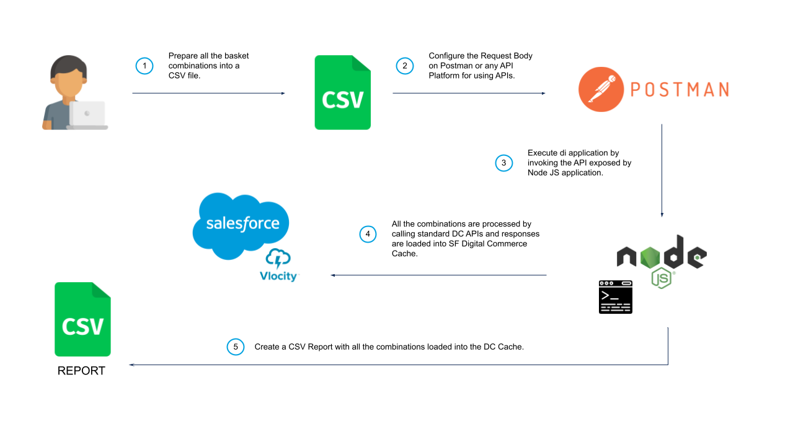

# SFI Digital Warmup Cache Tool

### Overview
Digital Commerce Warmup Cache is a procedure which uses the DC standard Basket API in order to initialize the Digital Commerce Cache with all the basket combinations provided by a CSV file passed as an input parameter. The scope of the solution is to decrease the number of Cache Miss when the anonymous Basket APIs are invoked.

### Solution 
The procedure is built with a Node JS application, which is running into a local server on your local machine. Express JS (web application framework for Node JS) is used to provide the API to initialize the DC Cache.



The Warmup Procedure can be launched by any REST Client for API testing (like Postman, Swagger, SoapUI, etc..).

Each products combination defines an AddToBasket API to be invoked. The procedure processes a block of concurrent requests (the concurrent number of the requests is one of the request param of the API).

The Warmup Procedure can be executed by populating directly the Salesforce Warmup Cache, or AWS Redis Cache if you are using the Digital Commerce Tier. Platform can be specified as an input param of the procedure.

At the end of the Warmup Procedure, a Report is created in order to track every single request with related details such as CartContextKey, Delay, Timestamp, Cache Miss or Cache Hit (for AWS).


### Getting Started


Install all the dependencies.
```sh
$ npm i
```

Build the app for production to the `build` folder.
```sh
$ npm run build
```

Run the application.
```sh
$ npm start
```
Open [http://localhost:5000](http://localhost:5000) to view it locally in the browser.

### WARMUP BASKET API
warmup BasketAPIs

* `POST http://localhost:5000/api/exec_warmup_cache_basket`

Request Body:
```json
{
    "fileCSV": "<file>",
    "catalogCode": "<string>",
    "concurrentRequests": "<number>",
    "limit": "<number>",
    "platform": "AWS or SFDC"
}
```
`fileCSV`: Your CSV File.

`catalogCode`: Catalog Code you will use for the getOffers APIs.

`concurrentRequests`: Number of concurrent requests will be processed every each block.

`limit`: Number of file rows will be processed.

`platform` : Name of platform you want to direct integrate with your calls. `AWS` or `SFDC`.

###  CSV Example File

| RootProductCombinations | Childs |
| ----------------------- | ------ |
| Football | |
| Sport | |
| Cinema | |
| Entertainment | |
| Entertainment\|EntertainmentPlus | |
| Entertainment\|EntertainmentPlus | "{'EntertainmentPlus':['Netflix']}" |
| Entertainment\|EntertainmentPlus\|Sport | "{'EntertainmentPlus':['Netflix']}" |
| Entertainment\|EntertainmentPlus\|Sport\|Cinema | "{'EntertainmentPlus':['Netflix']}" |
| Entertainment\|EntertainmentPlus\|Sport\|Cinema\|PlatformIP | "{'EntertainmentPlus':['Netflix']}" |

### .env File

SFDC Config
```
SFDC_USERNAME={{salesforce_username}}
SFDC_PASSWORD={{salesforce_psw}}
SFDC_ORG=login or test
SFDC_CONTEXT_URL=/vlocity_cmt/v3/context
SFDC_URL=/vlocity_cmt/v3/catalogs
```

AWS Config
```
AWS_BASEURL=https://{{api_gateway_host}}/dc/v3
AWS_CATALOGS_URL=https://{{api_gateway_host}}/dc/v3/catalogs
AWS_CONTEXT_URL=https://{{api_gateway_host}}/dc/v3/context
AWS_OAUTH_HOST={{oauth_host}}
AWS_CLIENT_ID={{clientId}}
AWS_CLIENT_SECRET={{clientSecret}}
```